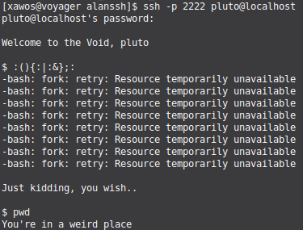
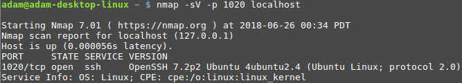

# WACT
## Simple CTF for newbies via SSH

Also useful to learn how not to implement security in a project, along with some bad implementation choices.

The name is an acronym for "Wow, another CTF thingy!"

Little CTF thingy, which has `paramiko` and `linereader` as dependencies.

It has a minimum of `security` (just kidding, it has none).

Users and ACLs are defined in the `keys/iam.csv` file (I know..).

It emulates an SSH server with some basic functionality and riddles to reach the next level (11 in total for now, very basic).

The hints returned have to be used to connect to a new SSH session, with username and passwords defined in `files/*`.

## Usage
It's about time to switch to Python3, so:

`pip3 install paramiko linereader`

Then simply run the file to start the server:

`./fake_ssh.py`

For convenience I've switched to port 2222 for testing, feel free to change that before running.
Keep in mind that unprivileged users can only run below port 1024 in Linux by default.

## Does it log?
Yep, in the following file:
	- `logs/log.txt`    logs all the commands entered, with prefixed IP, just to add another service logging user activity :P

This whole thingy was built in a weekend plus a couple of hours, so don't judge :P 

Based freely on [cheeseandcereal](https://github.com/cheeseandcereal)'s [fake-ssh](https://github.com/cheeseandcereal/fake-ssh), just like the following image (but not the above one, you may notice the different hosts/usernames lol):

